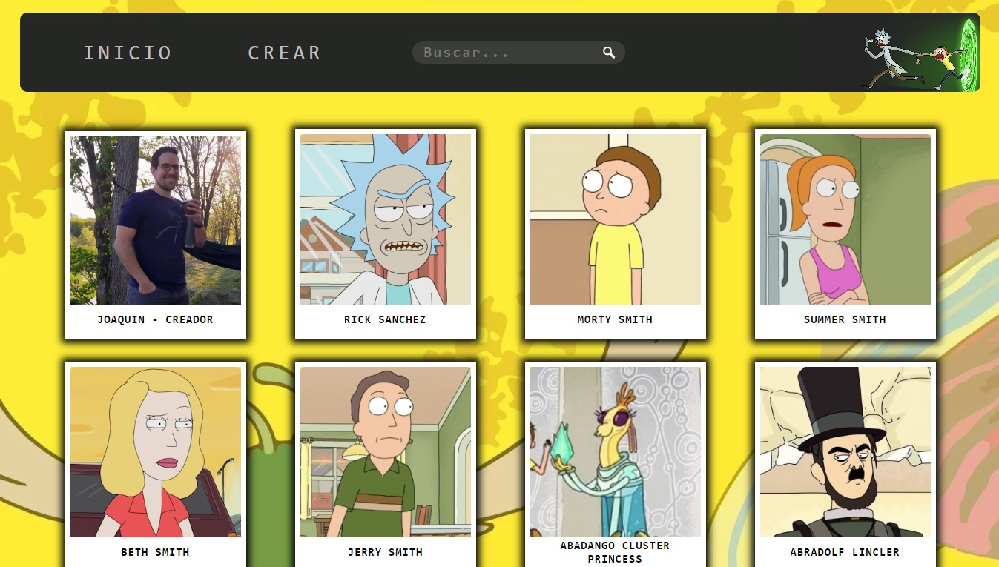
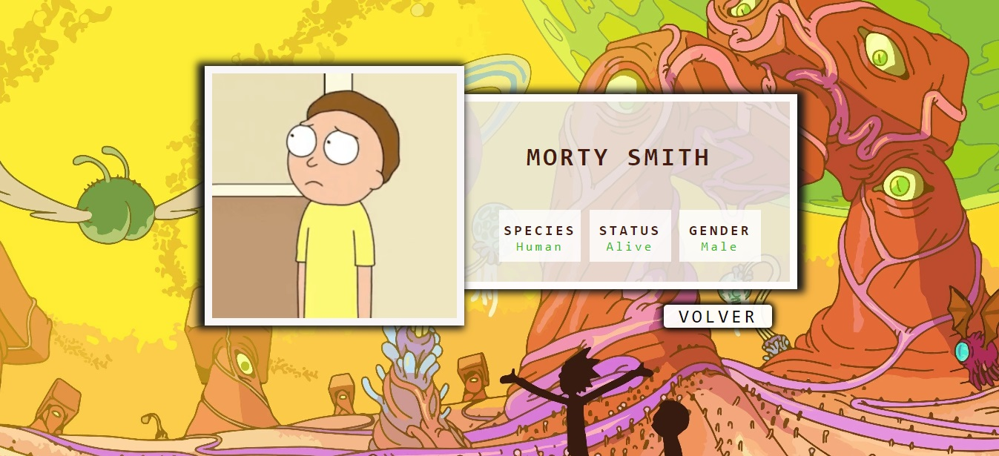
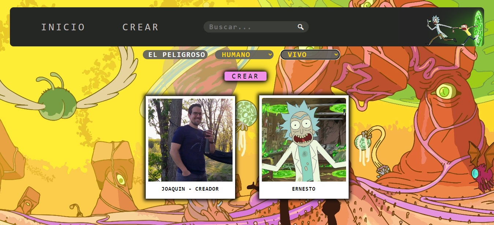
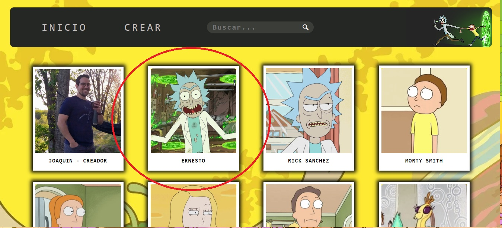

 

  

 

# Individual Project - Front End - Rick and Morty App.

  

## Objetivos del Proyecto

- Construir una App utlizando React, Redux y CSS puro.
- Afirmar y conectar los conceptos aprendidos en la carrera.
- Aprender mejores prácticas.
- Aprender y practicar el workflow de GIT.

## Resultado

La idea general fue realizar el desarrollo Front End de una aplicación en la cual se pueda ver información de los distintos personajes de Rick and Morty, utilizando la api externa [The Rick and Morty API
](https://rickandmortyapi.com/) y a partir de ella poder, entre otras cosas:

- Buscar los personajes
- Crear actividades turísticas
- Buscar personajes por ID
- Poder ingresar y ver el detalle de cada personaje

#### Tecnologías utilizadas

- [ ] React
- [ ] Redux
- [ ] JavaScript
- [ ] CSS

## Frontend

Aplicación de React/Redux que contiene las siguientes pantallas/rutas.

**Pagina inicial**: landing page con

- [ ] Imagen de fondo representativa al proyecto
- [ ] Botón para ingresar al home (`Ruta principal`)

<h3>Landing Page<h3>
  

**Ruta principal**: contiene

- [ ] Input de búsqueda para encontrar personajes de la saga por ID
- [ ] Área donde se ve la lista de los personajes. Al iniciar, carga los primeros resultados obtenidos por el dispatch de la action "getCharacters" y muestra su:
  - Imagen
  - Nombre
- [ ] Boton para ir al formulario de creación de un nuevo personaje
- [ ] Paginado para ir buscando y mostrando los siguientes paises.

<h3>Home page y Search Bar<h3>
  

<h3>Search Bar<h3>
  

**Ruta de detalle de personaje**: contiene

- [ ] Nombre
- [ ] Especie
- [ ] Estatus
- [ ] Genero
- [ ] Boton para volver al home

<h3>Detail<h3>
  

**Ruta de creación de un nuevo personaje**: contiene

- [ ] Un formulario con los siguientes campos:
  - Nombre
  - Especie
  - Estado
- [ ] Botón/Opción para crear el personaje
- [ ] renderización de los personajes creados en la misma pagina del formulario y en el home

El formulario de creación está validado con JavaScript.

<h3>Create page<h3>
  

  

